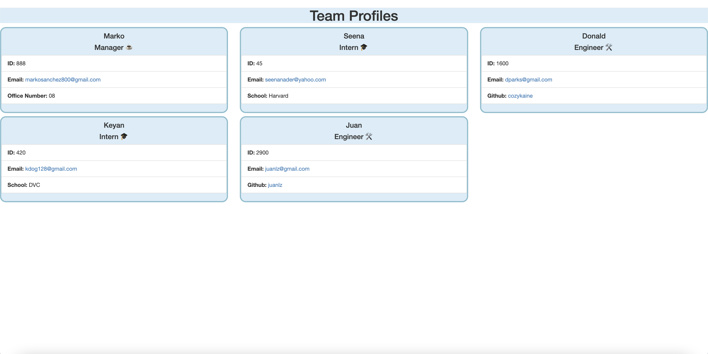

# Team Profile Generator

## Generated Page


## Summary
This application was created to display a user and their team's information for easy access.  Utilizing the inquirer package the app gathers input from the command line and generates HTML elements accordingly.  All additions to the page are created as class extensions of the Employee class, with additional elements depending on the role.

## Code Snippet
The initial Employee class that the rest of the classes extend from
```
class Employee {
    constructor(name,id,email){
        this.name = name;
        this.id = id;
        this.email = email;
    }

    getName(){
        console.log(this.name);
        return this.name;
    }
    getId(){
        console.log(this.id);
        return this.id;
    }
    getEmail(){
        console.log(this.email);
        return this.email;
    }
    getRole(){
        return 'Employee';
    }
};

```

## Technologies Used
- JavaScript - Implemented to make use of the installed npm packages, collect user input and create/append to a file from the users input based in template literals
- Inquirer - Used to ask questions to user about their team and collect that information to be sent back to java file and be planted into HTML
- Node.js - Used to run application from command line so that all processes can run through javascript

## Walkthrough Video
[Video](https://www.youtube.com/watch?v=ZwqgbLdUJPw&t=31s&ab_channel=markosanchez)

## Author Links
- [LinkedIn] (https://www.linkedin.com/in/marko-sanchez-800)
- [GitHub] (https://github.com/markosanchez800)

